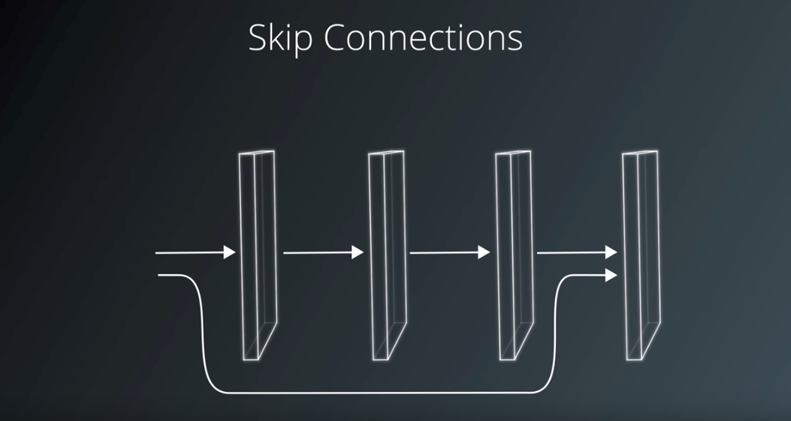

# Semantic Segmentation

### Experiments

run 1504373320.2554092

    EPOCHS = 20
    BATCH_SIZE = 8
    KEEP_PROB = 0.5
    LEARNING_RATE = 0.001
    
    Loss is not recorded.

run 1504378792.6229403
    
    EPOCHS = 8
    BATCH_SIZE = 8
    KEEP_PROB = 0.75
    LEARNING_RATE = 0.001
    
     0.23218602
    
run 1504379772.298715

    EPOCHS = 8
    BATCH_SIZE = 8
    KEEP_PROB = 0.40
    LEARNING_RATE = 0.001
    
    0.184747636
    
run 1504381343.1226273

    EPOCHS = 25
    BATCH_SIZE = 8
    KEEP_PROB = 0.40
    LEARNING_RATE = 0.001
    
    0.103782199
    
run 1504383727.2657874

    EPOCHS = 40
    BATCH_SIZE = 8 
    KEEP_PROB = 0.75
    LEARNING_RATE = 0.0001
    
    0.047683913
    



TODO: Using TensorBoard to visualize network and training results in each stages

TODO: Experimenting optimization

### Introduction
In this project, you'll label the pixels of a road in images using a Fully Convolutional Network (FCN).

### Setup
##### Frameworks and Packages
Make sure you have the following is installed:
 - [Python 3](https://www.python.org/)
 - [TensorFlow](https://www.tensorflow.org/)
 - [NumPy](http://www.numpy.org/)
 - [SciPy](https://www.scipy.org/)
##### Dataset
Download the [Kitti Road dataset](http://www.cvlibs.net/datasets/kitti/eval_road.php) from [here](http://www.cvlibs.net/download.php?file=data_road.zip).  Extract the dataset in the `data` folder.  This will create the folder `data_road` with all the training a test images.

### Start
##### Implement
Implement the code in the `main.py` module indicated by the "TODO" comments.
The comments indicated with "OPTIONAL" tag are not required to complete.
##### Run
Run the following command to run the project:
```
python main.py
```
**Note** If running this in Jupyter Notebook system messages, such as those regarding test status, may appear in the terminal rather than the notebook.

### Submission
1. Ensure you've passed all the unit tests.
2. Ensure you pass all points on [the rubric](https://review.udacity.com/#!/rubrics/989/view).
3. Submit the following in a zip file.
 - `helper.py`
 - `main.py`
 - `project_tests.py`
 - Newest inference images from `runs` folder
